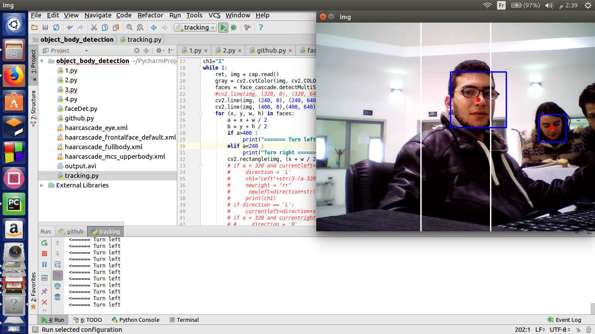

# smartCam

In this project we designed our own surveillance system using a raspberryPi3 microprocessor and USB camera with the ability to turn left or right using a servo motor. Once it detects a face it begins recording automatically while keeping it in the center of the picture.  
Technologies used:

- Linux & bash scripts
- Python programming language.
- Opencv : artificial vision library.
- Multithreading : to synchronize multiple tasks.

  

